# transactionnotes

An application that you can add your own notes and attachments to bank transactions.

## Pre-requisite: Keycloak

This app uses a running Keycloak instance. First we need to create a realm called `transactionnotes`. This is done by selecting `Create Realm`. Name this realm `transactionnotes`.

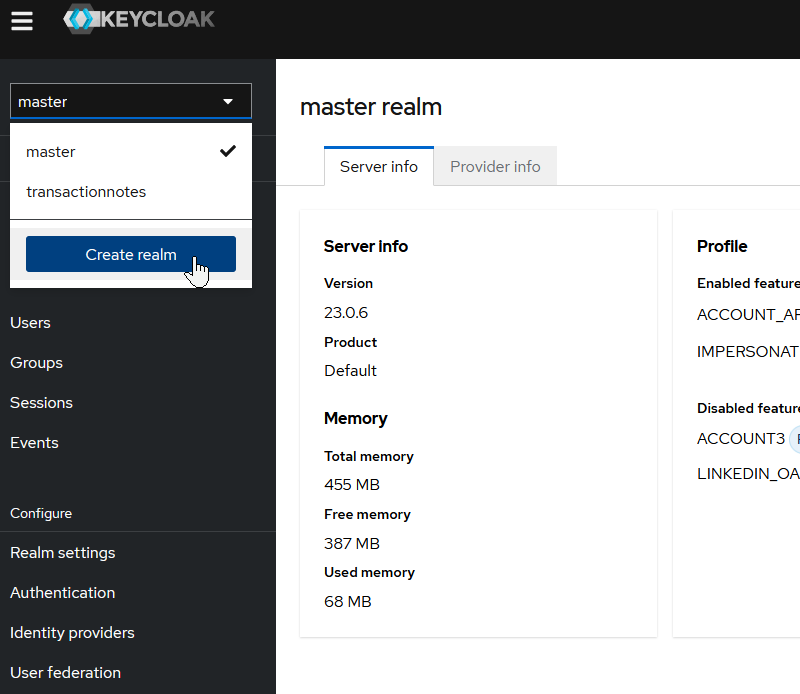

Select the `transactionnotes` realm from the drop down menu, and create a client called `transactionnotes`, using the Client Type `OpenId Connect` and a ClientId of `transactionnotes`

### Realm Email
The email settings for the realm should be set up as follows. You need a smtp server - we  used a free [Brevo](https://www.brevo.com/) account for this. Once an account has been created at Brevo, the email settings should be specified as follows:


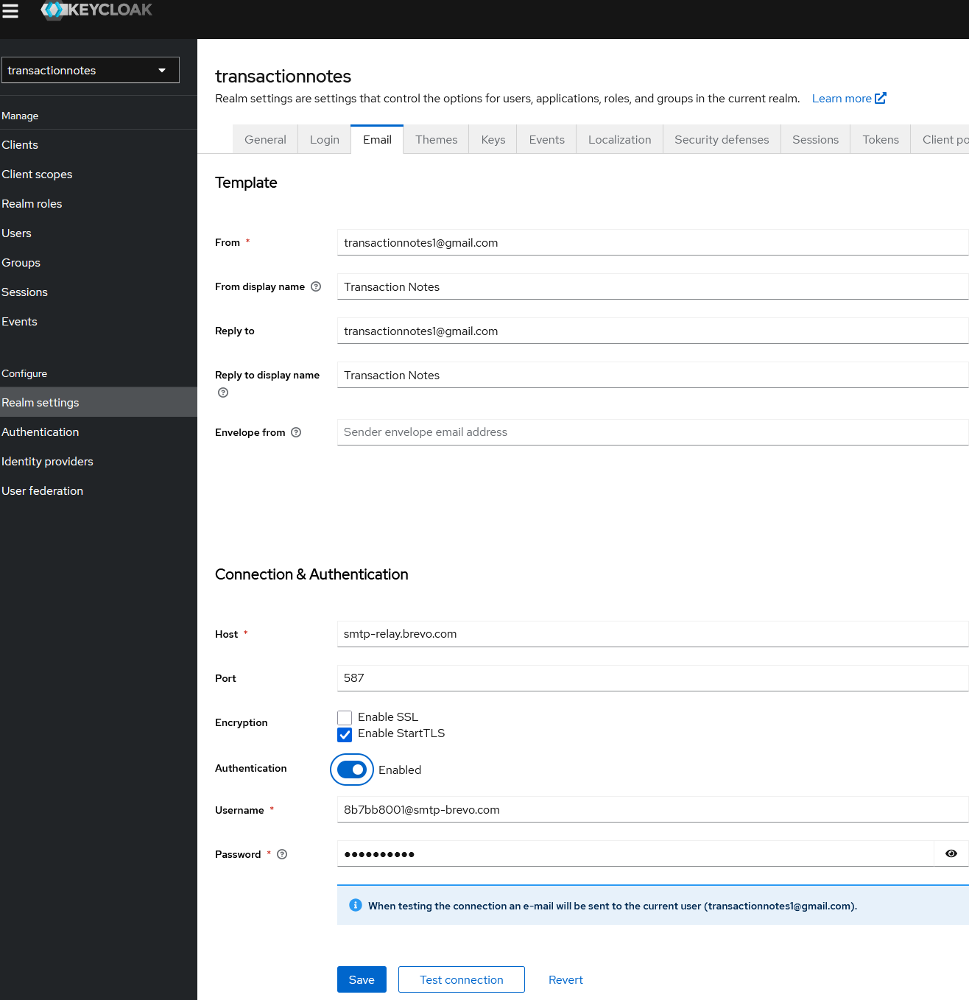

## Create a Client App


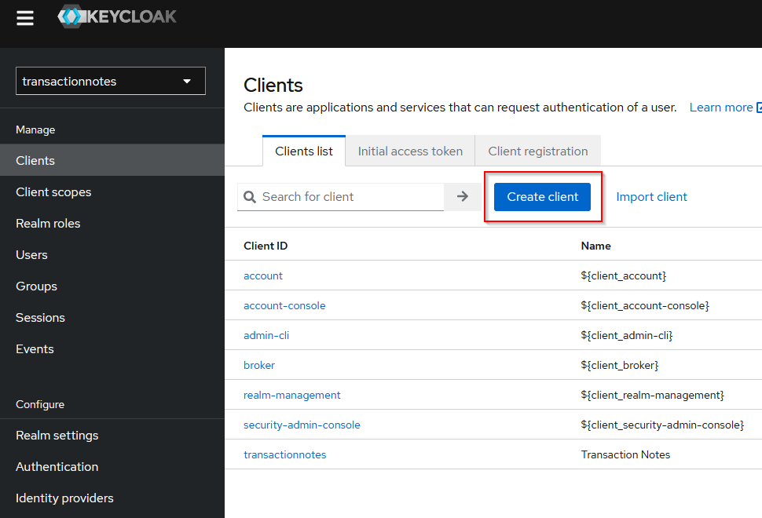

- Client Authentication is `ON`
- Authorization is `ON`
- Authentication Flow is set to: `Standard Flow` and `Direct Access Grant`
- The Client Credentials is saved in password manager under `transactionnotes`

 with a client Id called `transactionnotes` and a client secret

Once the client has been created, set the `redirect_url` to be wildcard `*`. This is ok for development, but in a production setting this should be more specific.


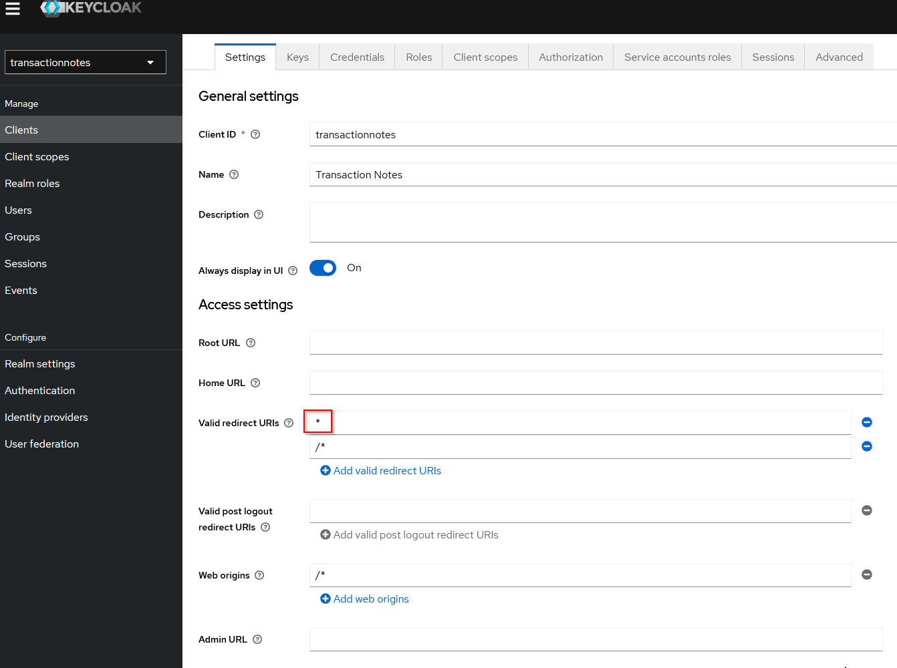


- Information about this Realm should be specified in the `appsettings.Development.json` of the `transactionnotes.AppHost` project, using a section like.
```
  "TransNotes": {
    "Authority": "https://auth.nganfamily.com/realms/transactionnotes/",
    "ClientSecret": "<Redacted>",
    "ClientId": "transactionnotes"
  }
```

The redacted secret can be obtained by logging into Keycloak using `admin` and looking at the registered `Clients`.

### Authorisation roles

The app expects the OAuth JWT to possess one or more of these four roles:
- `transactionnotes-subscriber` : allows closing down of the account, and managing users
- `transactionnotes-admin` : allows managing users, managing bank feeds
- `transactionnotes-write` : allows adding attachments and annotations to bank transactions
- `transactionnotes-read`  : allows reading the bank transactions and downloading attachments

These roles are added into the Keycloak as Realm Roles in the realm `transactionnotes`. 

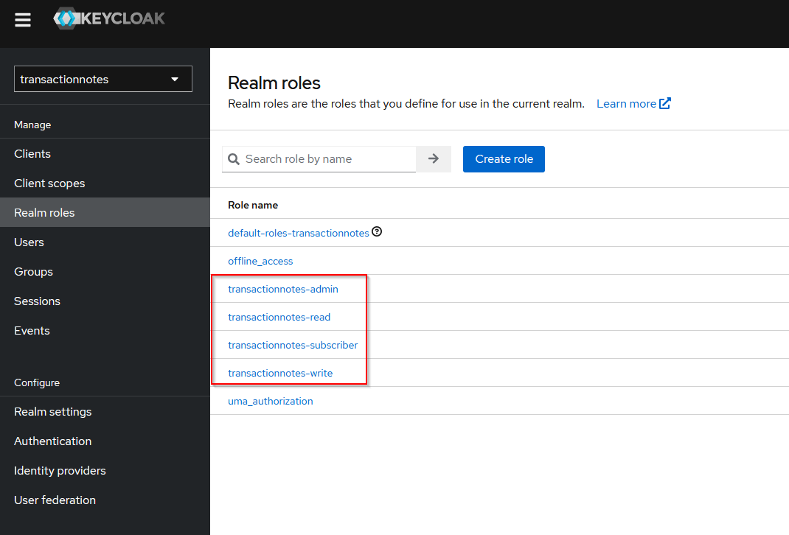

## Client Scope Mappers
### Map Path

Once these roles have been created, a mapping is required to place them into the location that the ASP.NET Authentication library expects them to be located in the JWT token. Click on `roles` and then edit the  `realm roles`.

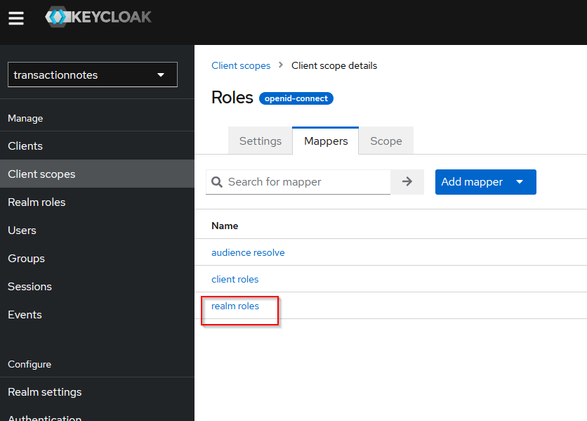


Configure the mapper, to state that the path of the roles in under the top level key `role` (singular not plural).

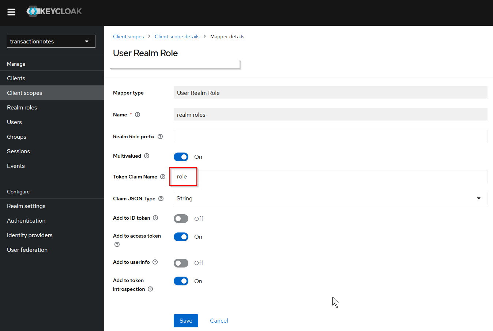

Reference: https://stackoverflow.com/a/58043503/41410

### Map aud (audience claim)
Add a mapper by Configuration - choose `Audience`

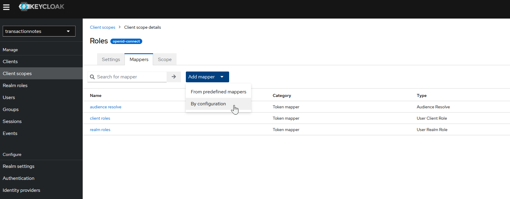

Then add `transactionnotes` as an addition `aud` claim to the JWT token.

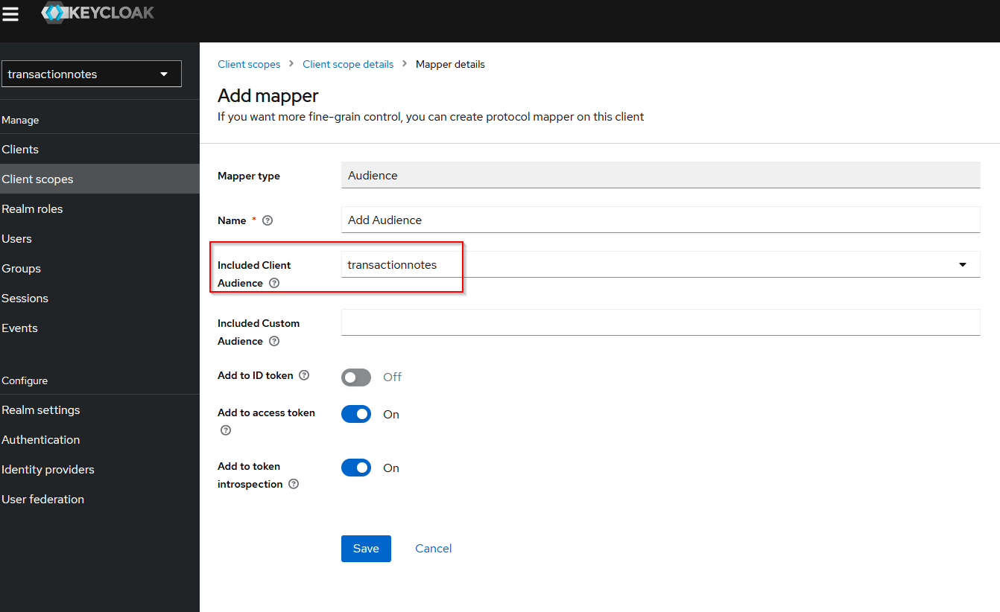

If this is not done, then when viewing the Weather page, the even though it has the `transactionnotes-writer` authorisation, it will still say that you are not authorised - this is because the `aud` needs to inlcude `transactionnotes`.

## Bug in roles and its remediation

There is a bug in the Microsoft role handling which does not extract the role correctly. So an extra remediation is required. Reference: https://stackoverflow.com/a/58043503/41410

This has been added to the code.


## Docker Compose

### Build and deploy to Docker Compose

This app is built using  .Net Aspire. By default these app are deployed publically to Azure Container Services. However using a tool called `aspirate` they can be deployed to container targets such as
Docker Compose. To deploy to docker compose, you first need `Docker` installed on the developer machine, and have it running.

Then run the command script [publish-to-dockerhub.cmd](publish-to-dockerhub.cmd) . The contents of this script needs to be changed to your particular dockerhub account. The aspirate secrets are 
stored in my password manager.

This command will create a set of docker containers that should be pushed to a docker image repository - such as dockerhub - and a `docker-compose.yaml` file. This file needs a few adjustments 
and has been saved as [docker-compose.yaml](docker-compose.yaml).

## Azure

The most convenient way to deploy .Net Aspire apps to the public is to host them on Azure Container Services. In this repository, GitHub actions has been setup to deploy to Azure.

### Build and deploy to Azure

- On GitHub, click `Actions`
- Open the github workflow `azure-dev.yaml`, and click the `Run workflow` button

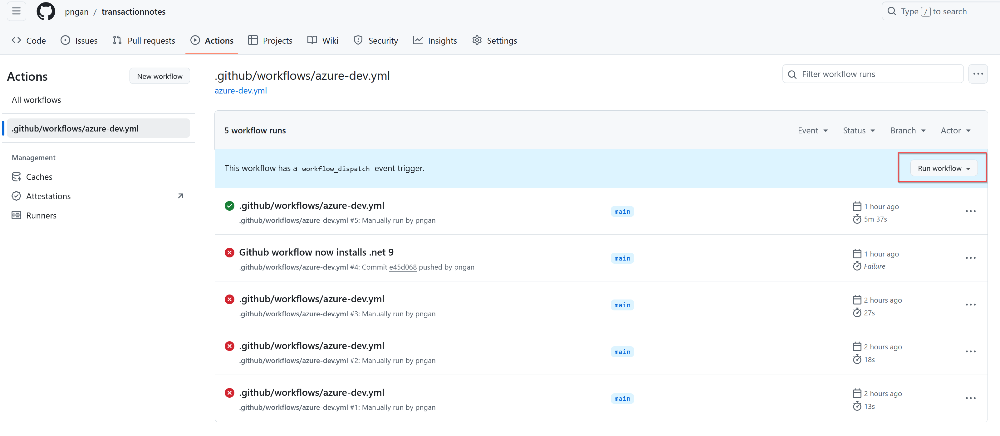
### Open the Aspire Dashboard and view App

To get the Aspire Dashboard showing in Azure
- Open the build deployment output and find the dashboard link

Or
    - [Open Azure Portal](https://portal.azure.com)
    - Click `rg-transactionnotes`
    - `Container Apps Environment`
    - `Open Dashboard`


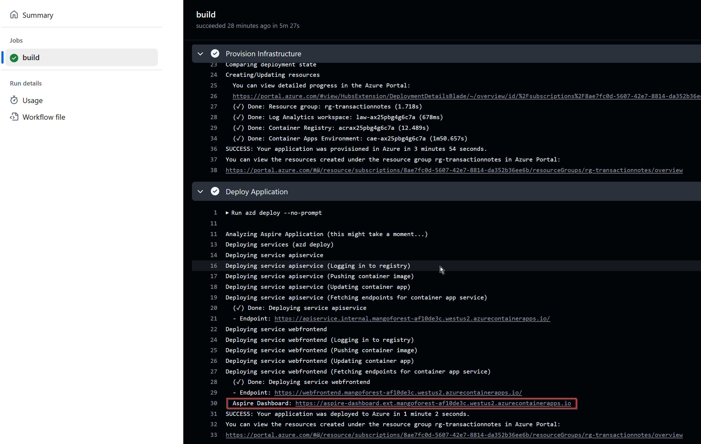

- You must first give your user Contributor permission to the `Container Apps Managed Environments`. Otherwise you will get the error: "Could not authenticate user with requested resource."
    - [Open Azure Portal](https://portal.azure.com)
    - Click `rg-transactionnotes`
    - Access Control (IAM)
    - `Add Role Assignment`
    - `Privileged administrator roles`
    - `Contributor` > `Next`
    - `Members` > `User, group, or service principal` 
    - `Select Members` > <your login email> > `Select`
    - `Review + assign`
    - `Review + assign`


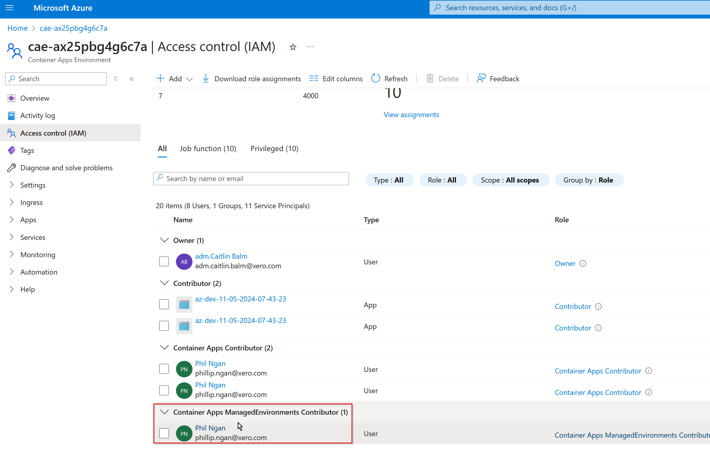


### Tear down the deployment

 - `cd transactionnotes\transactionnotes.AppHost`
 - azd down

### Prerequisites

- `azd` Azure Deploy command line tool -  `choco install azd`
 
### Reference

- [Create Aspire Blazor App using Visual Studio](https://youtu.be/BBGeousUHQU?si=UtCmni5sZBfo92qV)
- [Deploy App to Azure Container Services using GitHub Actions](https://learn.microsoft.com/en-us/dotnet/aspire/deployment/azure/aca-deployment-github-actions?tabs=windows&pivots=github-actions)

## Troubleshooting

If the github actions workflow fails with this error:
```
 Deploying service apiservice (Logging in to registry)
  (x) Failed: Deploying service apiservice

ERROR: failed deploying service 'apiservice': logging in to registry: failed logging into container registry, token: failed getting ACR token:
```

It is because some secret has expired in github secrets.
Refresh the credentials, by own your Windows machine
```
cd transactionnotes\transactionnotes.AppHost
azd pipeline config
```

 Once the secrets have been refreshed, try running the github action again.

----


If the github actions workflow fails with this error:
```
panic: don't know how to prompt for type *survey.Password
```
This is error arises when a new Aspire parameter has been added, e.g.
```
var password = builder.AddParameter("keycloak-password", secret: true);
```
`azd` prompts for that missing paramter when it is running in github actions, but cannot interactively prompt.

The solution is to re-run on your local developer machine:
```
cd transactionnotes\transactionnotes.AppHost
azd pipeline config
```
This will prompt you for the missing secret values and store them with the Actions in the source repo.

## notes

Add a service to .NET Aspire
```
# For example, create a new console app
mkdir transactionnotes.Database
cd transactionnotes.Database
dotnet new worker -o centraldb-migration

# Add the new console to the AppHost project
dotnet add .\transactionnotes.AppHost\transactionnotes.AppHost.csproj reference .\transactionnotes.Database\centraldb-migration\centraldb-migration.csproj
```