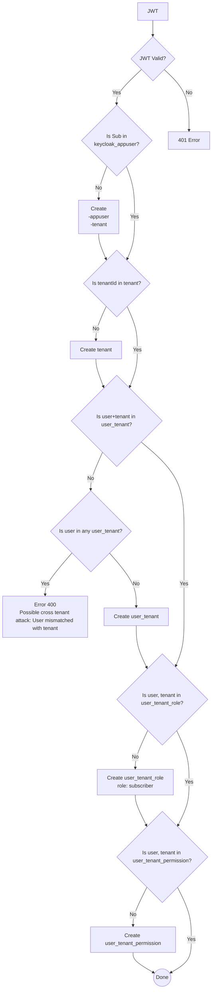

# Login flow 

```mermaid
flowchart TD
    
    B[JWT] --> C{JWT Valid?}
    C -->|Yes| D{Is Sub in <br> keycloak_appuser?}
    C -->|No| E[401 Error]
    D --> |No|F[Create<br>-appuser<br>-tenant]
    D--> |Yes|A
    Z --> H{Is user+tenant in user_tenant?}
    A --> |No|Z[Create tenant]
    A --> |Yes|H
    H -->|No| I{Is user in any user_tenant?}
    H --> |Yes|L
    I -->|Yes| K[Error 400<br>Possible cross tenant attack: User mismatched with tenant]
    I --> |No|J[Create user_tenant]
    F --> A{Is tenantId in tenant?}
    J --> L{Is user, tenant in user_tenant_role?}
    L -->|No|M[Create user_tenant_role<br>role: subscriber]
    M --> N{Is user, tenant in user_tenant_permission?}
    N -->|No| O[Create user_tenant_permission]
    L --> |Yes| N
    O --> P((Done))
    N --> |Yes|P
```